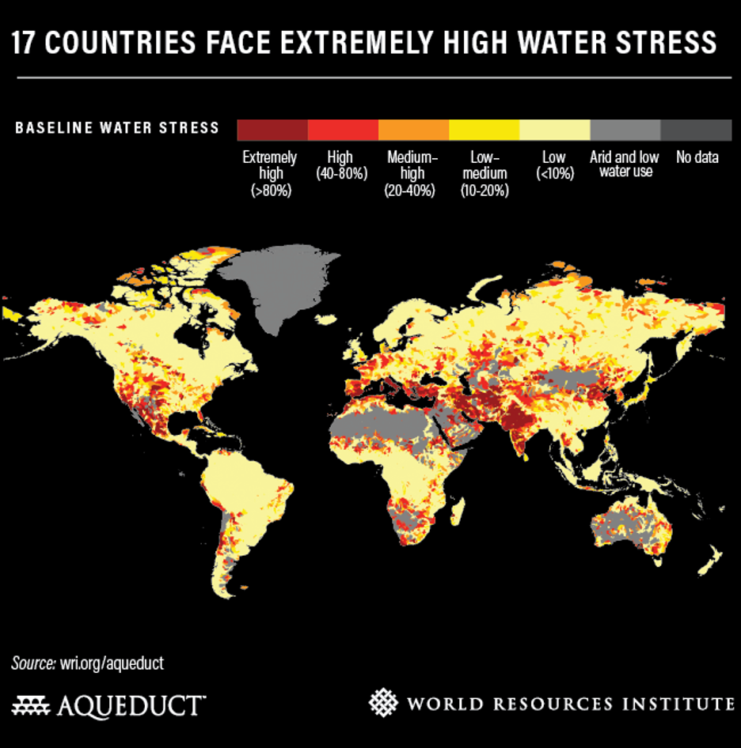
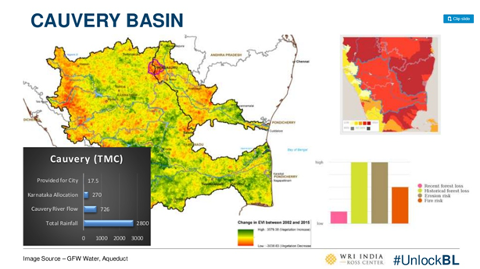
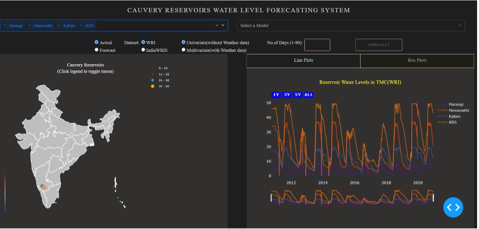
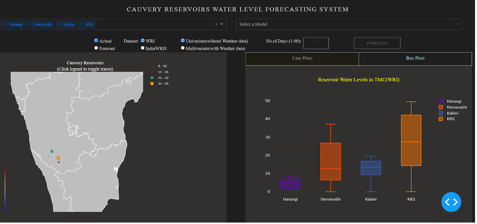
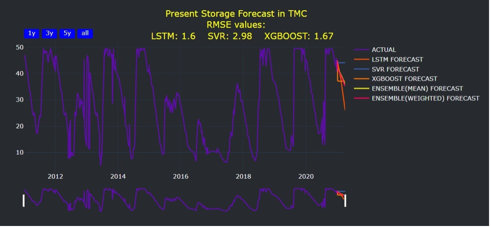

# Reservoir Water Level Forecasting

  
  
  
  
  
  
  
  
  

  

## Problem Statement
### Background
WRI’s updated Aqueduct Water Risk Atlas finds that 17 countries, which are home to a quarter of the world’s population, face “extremely high” water stress. India ranks 13th for overall water stress and has more than three times the population of the other 17 extremely highly stressed countries combined. India’s water challenges extend beyond current events in Chennai. Last year, the National Institution for Transforming India (NITI Aayog), a government research agency, declared that the country is “suffering from the worst water crisis in its history, and millions of lives and livelihoods are under threat.

Cities in the Global South face unreliable, inadequate, and polluted supply of freshwater. About 1 billion people do not have access to safe and continuous (24/7) water supply. These cities show that vast segments of the urban population in the global south lack access to safe, reliable and affordable water. On average, almost half of all households in the studied cities lacked still lack access to piped utility water. 

### Case of Bengaluru, India
Bengaluru, the capital of Karnataka, is one of the fastest growing cities in India. The city is known for its pleasant climate, beautiful gardens, and lakes. However, the city is facing a severe water crisis. According to the experts Bengaluru is on the verge of an **imminent water crisis**, with the city’s water table shrinking massively in just two decades. 

The city could follow Cape Town to become the first Indian city to run out of water unless urgent measures are taken. As the population increases, the demand for water also increases. Water is being sourced from Cauvery river reservoirs to meet Bengaluru's increasing water demands. But, the water supply has become a major challenge  due to various factors like climate change, deforestation, unplanned urbanization, depleting ground water resources due to unprecedented borewell extraction etc.

**Cauvery reservoirs** *(Harangi, Hemavathi, KRS, Kabini)*, which are major source of water for Bengaluru, are already under extremely high water risk  category, indicating drought like situation,  as per the data collected from World Resources Institute Aqueduct tool. 

Forecasting water availability accurately is challenging, due to uncertain hydro-meteorological  and other factors of Cauvery river basin.

**The objective of this project is to forecast the water levels in the Cauvery reservoirs, which will help in better water management and planning for the city of Bengaluru.**

## Solution
A multi-stacking ensemble based multi-variate time series analysis model using machine learning, deep learning and statistical procedures like Support Vector Regressor(SVR), XGBoost, Facebook Neural Prophet, Long Short Term Memory(LSTM) and Seasonal Auto Regressive Integrated Moving Averages (SARIMA) with near real time reservoir water level data, and associated hydro-meteorological data like rainfall, temperature etc. for better and accurate temporal water level forecasting.

## Data
The dataset is obtained from the official WRI website and India WRIS datasets. It includes the geospatial data of four cauvery river basin reservoirs Hemavathi, Harangi, Kabini and KRS.  
| Dataset Source | Dataset Name | Date Range               | Original Row Count | Missing Rows | Final Date Range      | Final Row Count |
|---------------|-------------|-------------------------|--------------------|--------------|----------------------|----------------|
| WRI           | Harangi     | 30-09-2010 to 16-12-2020 | 3321               | 332          | 01-01-2011 to 31-12-2020 | 3653           |
| WRI           | Hemavathi   | 30-09-2010 to 16-12-2020 | 3314               | 339          | 01-01-2011 to 31-12-2020 | 3653           |
| WRI           | KRS         | 30-09-2010 to 16-12-2020 | 3313               | 340          | 01-01-2011 to 31-12-2020 | 3653           |
| WRI           | Kabini      | 30-09-2010 to 16-12-2020 | 3314               | 339          | 01-01-2011 to 31-12-2020 | 3653           |

## Functional Requirements
1. Dynamic Dashboard to view the results of the predictions
2. Visualizations of forecasted data
3. Predicting the water level using other features such as Inflow, Outflow, Rainfall, Soil Moisture, Humidity etc.
4. 1-3 months forecasts of water level
5. Correlation of the features crucial of water level prediction
6. Reservoir-wise forecasting
7. Scalable design to add new reservoir forecasting 

## Evaluation Metrics
Root Mean Square Error (RMSE), R2, Mean Absolute Percentage Error (MAPE)

## Model Performance

## Final Design of the Project
Here are some screenshots of the final design of the project.

## Dashboard Features
Demo video of the dashboard can be found [here](https://drive.google.com/file/d/1sTAAyVX3CmPLgNGGhuxafODhc-3nX2Ki/view?usp=sharing).
- Reservoir wise water forecasting
- Collective water forecasting
- Algorithm wise water forecasting
- Feature toggle options like with/without weather data
- Scalable design to add new reservoir forecasting

